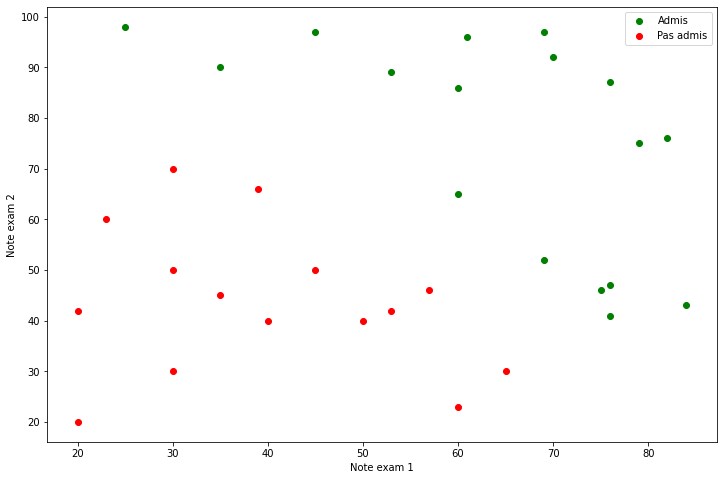
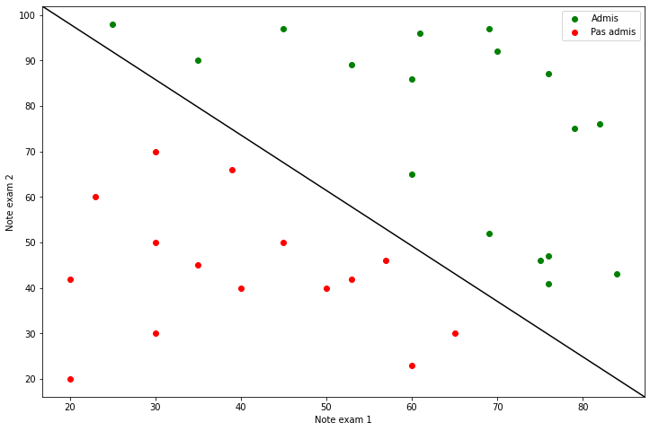
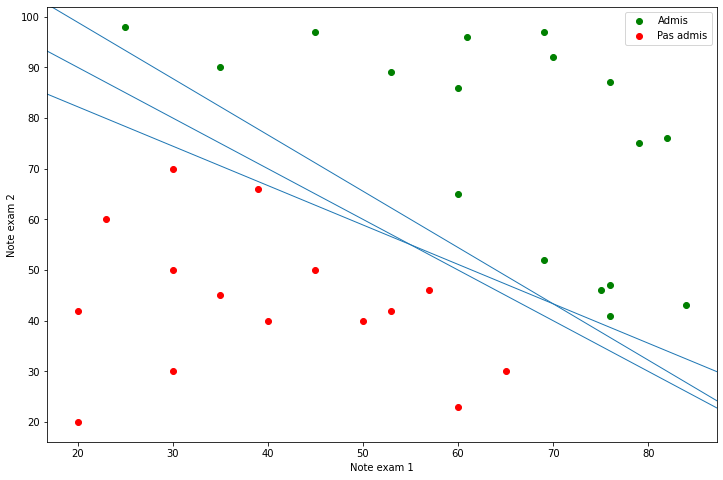
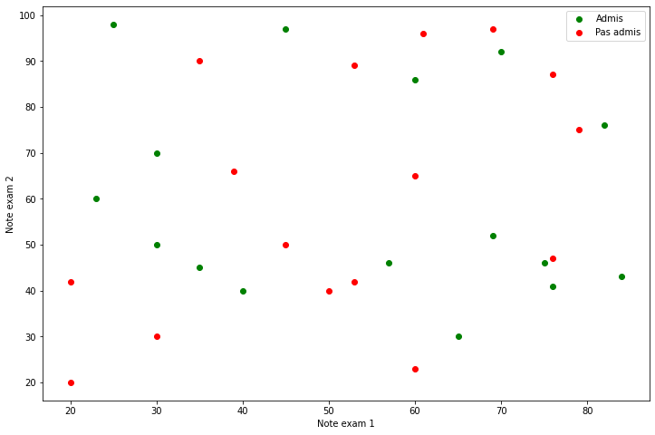

# Support Vector Machine

Dans notre example, nous allons observer l'admission d'étudiant dans une leur année supérieur et leurs notes d'examens.

Chaque étudiant a passé deux examens et à donc eux 2 notes, certains on réussi à passer, d'autre non, ces étudiants sont séparés dans deux régions différentes.
On voit bien qu'on peut séparer les données en deux ensembles distincts :

Cependant, la frontière entre ces deux régions n’est pas connue. Ce que l’on veut, c’est que quand on présentera un nouvel éleve, ayant passé ses examens dans un autre établissement et dont on ne connaît que la position dans le plan, l’algorithme de classification sera capable de prédire si ce nouvel éleve va passer ou non.

Le SVM est une solution à ce problème de classification. Le SVM appartient à la catégorie des classificateurs linéaires (qui utilisent une séparation linéaire des données), et qui dispose de sa méthode à lui pour trouver la frontière entre les catégories.

Pour que le SVM puisse trouver cette frontière, il est nécessaire de lui donner des données d’entraînement. En l’occurrence, on donne au SVM un ensemble de points, dont on sait déjà si ce sont des bons éléves ou non. A partir de ces données, le SVM va estimer l’emplacement le plus plausible de la frontière: c’est la période d'entraînement, nécessaire à tout algorithme d’apprentissage automatique. 

Une fois la phase d’entraînement terminée, le SVM a ainsi trouvé, à partir de données d’entraînement, l’emplacement supposé de la frontière.

Il existe plusieurs lignes droites qui peuvent séparer nos catégories. La plupart du temps, il y en a une infinité… Alors, laquelle choisir?

Intuitivement, on se dit que si on nous donne un nouveau point, très proche des ronds rouges, alors ce point a de fortes chances d’être un rond rouge lui aussi. Inversement, plus un point est près des points verts, plus il a de chances d’être lui-même un point vert. Pour cette raison, un SVM va placer la frontière aussi loin que possible des points verts, mais également aussi loin que possible des points rouges.
On dit de cette frontière qu’elle a la meilleure capacité de généralisation. Ainsi, le but d’un SVM est de trouver cette frontière optimale, en maximisant la distance entre les points d’entraînement et la frontière.

Les points d’entraînement les plus proches de la frontière sont appelés vecteurs support, et c’est d’eux que les SVM tirent leur nom: SVM signifie Support Vector Machine, ou Machines à Vecteur Support en français. Support, parce que ce sont ces points qui «supportent» la frontière.

  

Dans certains cas, il est impossible de trouver de ligne droite qui soit une frontière: on dit que les données d’entraînement ne sont pas linéairement séparables:

Dans ce genre cas on peut utiliser ce qu'on appele un `kernel trick`: Je vous laisse aller voir par vous-même [sur cette rubrique par exemple](https://fr.wikipedia.org/wiki/Machine_%C3%A0_vecteurs_de_support#Cas_non_s%C3%A9parable_:_kernel_trick).

